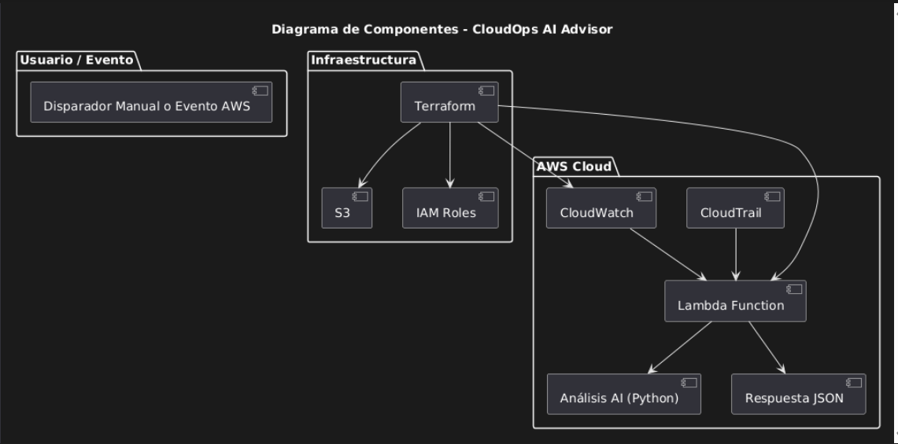

# ☁️ CloudOps AI Advisor

CloudOps AI Advisor es un proyecto educativo diseñado para aprender sobre arquitectura en la nube, automatización con infraestructura como código (IaC), funciones serverless (Lambda), monitoreo con CloudWatch y principios básicos de AIOps.

El objetivo es construir una base práctica para entender cómo los sistemas modernos pueden detectar y responder a anomalías de forma autónoma usando tecnologías de AWS.

## 🧠 Descripción general

Este sistema simula una arquitectura AIOps sencilla, enfocada en el monitoreo de métricas (como valores de sensores, consumo, rendimiento o KPIs técnicos) en tiempo real. Está diseñado para recibir valores dinámicos desde AWS, analizarlos y responder automáticamente si se detecta un comportamiento anómalo.

Todo se despliega usando Terraform, lo cual permite replicar la arquitectura de forma consistente, ya sea para fines de desarrollo, pruebas o aprendizaje individual.

## 🎓 ¿Para qué fue creado?

Este proyecto **no está orientado a producción**, sino como ejercicio práctico para:

- Aprender cómo se usan los servicios de AWS desde cero.
- Comprender cómo funciona el monitoreo y análisis de eventos.
- Familiarizarse con los flujos AIOps básicos.
- Aplicar buenas prácticas de automatización y logging.
- Construir un portafolio profesional con tecnologías modernas.

## 🔍 ¿Qué hace el agente inteligente?

El corazón del sistema es una función AWS Lambda escrita en Python, que actúa como un agente inteligente. Su comportamiento es el siguiente:

- **Recibe una métrica** numérica como entrada (por ejemplo, 0.87).
- **Evalúa su valor** contra un umbral configurable (ej. > 0.8).
- **Clasifica la métrica** como normal o anómala.
- **Responde** con un JSON indicando si se debe activar una alerta.
- **Registra logs estructurados** en CloudWatch (info/warning/error).
- **(Fases futuras)**: el agente podrá proponer acciones o integrarse con flujos de remediación automatizada.

## Tecnologías utilizadas

| Categoría      | Tecnología                                    |
| -------------- | --------------------------------------------- |
| IaC            | Terraform                                     |
| Nube           | AWS S3, Lambda, IAM, CloudWatch, CloudTrail   |
| Lenguaje       | Python (para Lambda)                          |
| Seguridad      | GitHub Secret Scanning, Roles y políticas IAM |
| Automatización | Git y GitHub                                  |

## Arquitectura

## Diagrama de la Estructura del Proyecto

